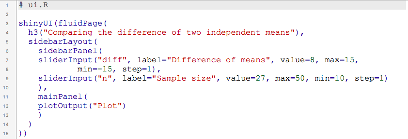
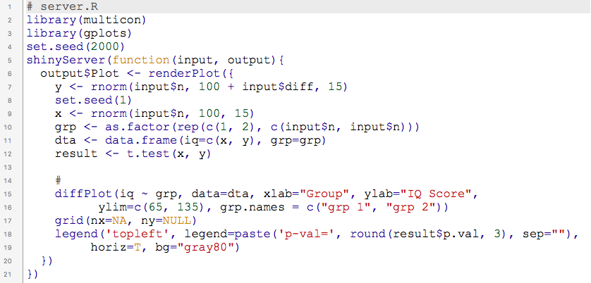

# **Overview**
- What is R?
- What is Shiny?
- Comparing the difference of two independent means
    - <https://goo.gl/ua2Lbb>
- Conclusion

# **What is R?**
- R is a language and environment for statistical computing.
- Some nice properties of R:
    - R is open source.
    - R is flexible.
    - The community of R is still growing.

# **What is Shiny?**
- Shiny is a web application framework for R.
- One could turn the analyses into interactive web application.
- No prerequisite knowledge of HTML, CSS, or JavaScript.

# **Comparing difference of two independent means**
- Assume there are IQ scores from two *independent* groups of students.
- The IQ scores follow a normal distribution.
```{r preparation, message = FALSE}
library(multicon)
library(gplots)
x <- rnorm(27, 100, 15)
y <- rnorm(27, 108, 15)
grp <- as.factor(rep(c(1, 2), each = 27))
dta <- data.frame(iq=c(x, y), grp=grp)
```

# **Have a Look in Dataset**
```{r output_data}
head(dta)
str(dta)
```

# **Descriptive Statistics**
```{r descrip}
with(dta, tapply(iq, grp, mean))
with(dta, tapply(iq, grp, sd))
```

# **Independent T-Test**
- Now we could conduct an independent t-test to examine
if there exists a significant difference between two group means.
```{r ttest, comment = ""}
t.test(x, y)
```

# **Draw the Plot**
```{r plot, fig.show = "hide"}
diffPlot(iq ~ grp, data = dta, xlab = "Group",
  ylab = "IQ Score", ylim = c(65, 135),
  grp.names = c("grp 1", "grp 2"))
grid(nx=NA, ny=NULL)
legend('topleft', horiz = TRUE, bg = "gray80",
  legend = paste('p-val=', round(t.test(x, y)$p.val, 3),
  sep = ""))
```

# **Draw the Plot: The Output**
```{r plot2, echo = FALSE}
diffPlot(iq ~ grp, data = dta, xlab = "Group",
  ylab = "IQ Score", ylim = c(65, 135),
  grp.names = c("grp 1", "grp 2"))
grid(nx=NA, ny=NULL)
legend('topleft', horiz = TRUE, bg = "gray80",
  legend = paste('p-val=', round(t.test(x, y)$p.val, 3), sep = ""))
```

# **Shiny Application**
- [Comparing means of two independent groups](https://shiny.is.depaul.edu/users/dallbrit/from%20CF%20Sheu/ConfidenceInterval/)

# **Concluion**
- Interactive graphic on Shiny application
could help users to have a better understanding.
- It is efficient to have a web application with R and Shiny.

# **Code Script of Shiny App**


# **Code Script of Shiny App**


# **Start using R!**
- R could make statistical and data analysis easier!

#
**Thank you for your attention!**